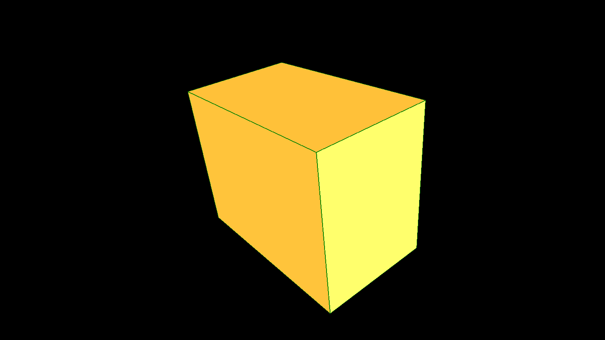
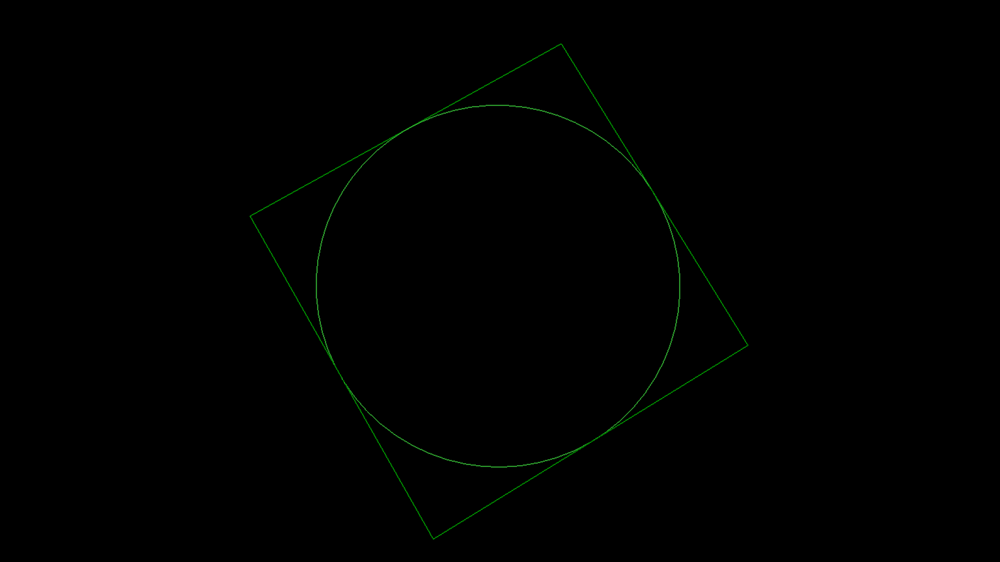
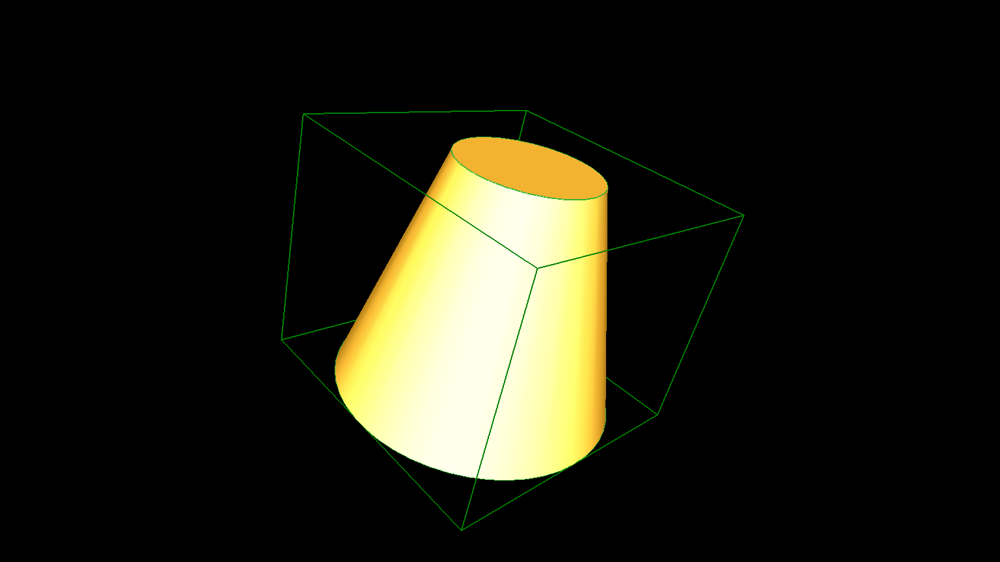
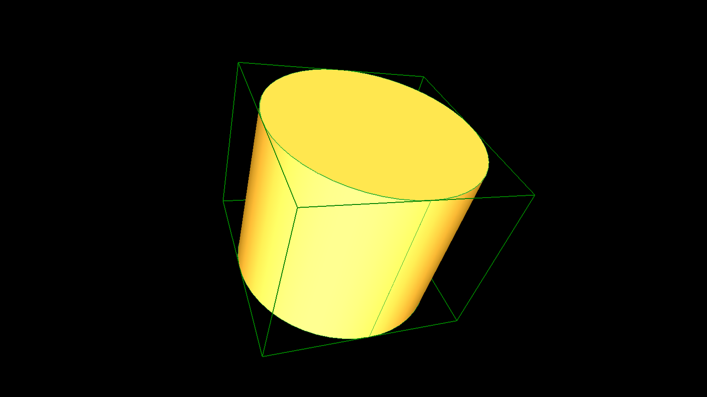
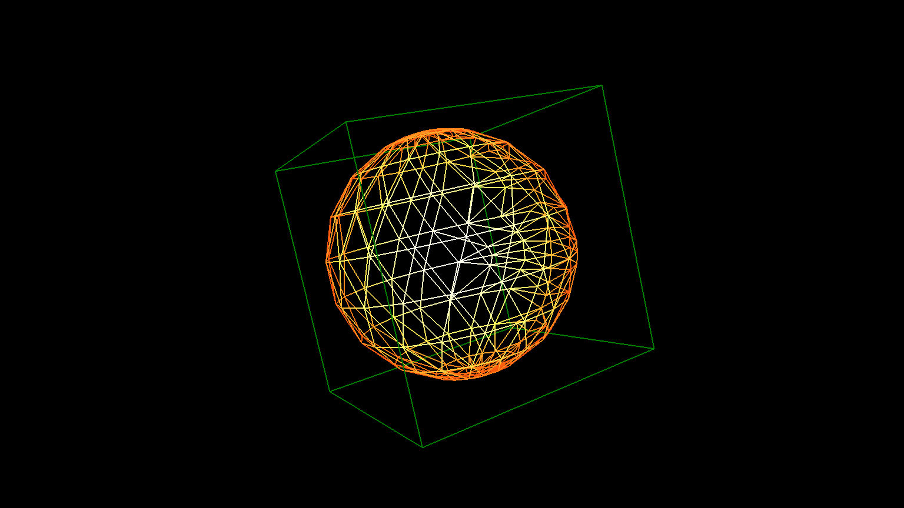
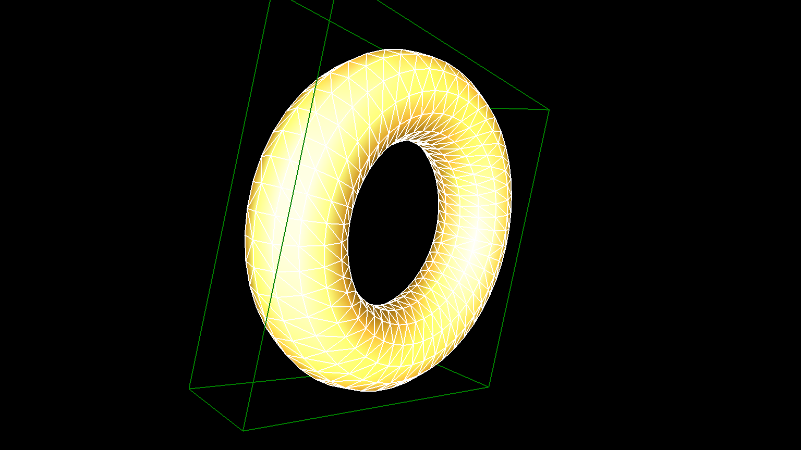

# occBasicSamples

Very basic OpenCASCADE examples that compile on Linux on the commandline with g++.
Only a .stl and .wrl is written that can be imported and viewed by a program like blender, MeshLab or view3dscene for example.
The purpose of these tiny example programs is to show the most basic usage of the Open CASCADE 3D library possible, thus flattening the learning curve for a beginner (like me).


## Installation

* OpenCascade (https://www.opencascade.com/doc/occt-7.1.0/overview/html/occt_dev_guides__building.html)
	* Building 3rd party libraries (https://www.opencascade.com/doc/occt-7.1.0/overview/html/occt_dev_guides__building_3rdparty_linux.html):
		```
		root> apt-get install g++ cmake cmake-curses-gui
		root> apt-get install tcllib tklib tcl-dev tk-dev libfreetype-dev libxt-dev libxmu-dev libxi-dev libgl1-mesa-dev libglu1-mesa-dev libfreeimage-dev libtbb-dev libgl2ps-dev 
		root> apt-get install doxygen graphviz
		root> apt-get install libqt4-dev libvtk6-dev libvtk6-qt-dev
		```
	* Download OpenCascade from https://www.opencascade.com/content/latest-release. You must create an account in order to do so.
	* Configure (https://www.opencascade.com/doc/occt-7.1.0/overview/html/occt_dev_guides__building_cmake.html):
		```
		user> mkdir opencascade
		user> cd opencascade/
		user> cp ~/Downloads/opencascade-7.1.0.tgz .
		user> tar -xvzf opencascade-7.1.0.tgz
		user> mkdir install
		user> mkdir build
		```
	* remove the lines containing "vtkRenderingFreeTypeOpenGL" from the files TKIVtk/EXTERNLIB and TKIVtkDraw/EXTERNLIB 
	  or u will get an linker error ( see: https://www.opencascade.com/content/compataility-latest-versions-vtk)
		```
		user> fgrep -irns vtkRenderingFreeTypeOpenGL ../opencascade-7.1.0/src/
			     ../opencascade-7.1.0/src/TKIVtk/EXTERNLIB:17:vtkRenderingFreeTypeOpenGL
			     ../opencascade-7.1.0/src/TKIVtkDraw/EXTERNLIB:23:vtkRenderingFreeTypeOpenGL
		```
		```
		user> cd build && ccmake ../opencascade-7.1.0/
		```
		* Adapt and configure the variables as you need them. 
		* Press the c key several times in order to solve all dependencies and generate the makefiles with the g-key then.
		* Here is what i have changed:
				> INSTALL_DIR                      ../install                                                                                                                                                
				> 3RDPARTY_SKIP_DOT_EXECUTABLE     OFF
				> INSTALL_DOC_Overview             ON                                                                                                                                                  
				> INSTALL_FREETYPE                 ON  
				> INSTALL_SAMPLES                  ON                                                                                                                                                        
				> INSTALL_TCL                      ON                                                                                                                                                        
				> INSTALL_TEST_CASES               ON                                                                                                                                                        
				> INSTALL_TK                       ON                                                                                                                                                        
				> USE_FREEIMAGE                    ON                                                                                                                                                        
				> USE_GL2PS                        ON                                                                                                                                                        
				> USE_TBB                          ON                                                                                                                                                        
				> USE_VTK                          ON
	* Compile:
		```
		user> make
		```
	* Install:
		* Link tcl8.6 to tcl8 if you get an that errormessage that tcl8 cannot be found: 
		      ```
		      root> ln -s /usr/lib/x86_64-linux-gnu/tcl8.6/ /usr/lib/x86_64-linux-gnu/tcl8
		      ```
		```
		user> make install
		```
	* Add the OpenCascade libraries to your library path:
		```
		root> cd /etc/ld.so.conf.d/
		root> echo '/home/arno/Projects/opencascade/install/lib' > opencascade.conf
		root> ldconfig
		``` 

	*  These examples
		* TODO: 
			* git pull
			* compile
			* link
			* run
			* view examples
			* makefile targets


## Available examples

Up to now there are examples for following basic shapes available:

**`Box:`**


**`Circle:`**


**`Cone:`**


**`Cylinder:`**


**`Sphere:`**


**`Torus:`**


## References

* https://github.com/eryar/occQt
* https://www.opencascade.com
* https://www.opencascade.com/doc/occt-7.1.0/overview/html/index.html
* https://www.opencascade.com/doc/occt-7.1.0/overview/html/occt_dev_guides__building_3rdparty_linux.html
* https://www.blender.org
* http://www.meshlab.net
* https://castle-engine.sourceforge.io/view3dscene.php


## Authors:

* quirxi (https://github.com/quirxi)


## License

Distributed under the MIT License.


